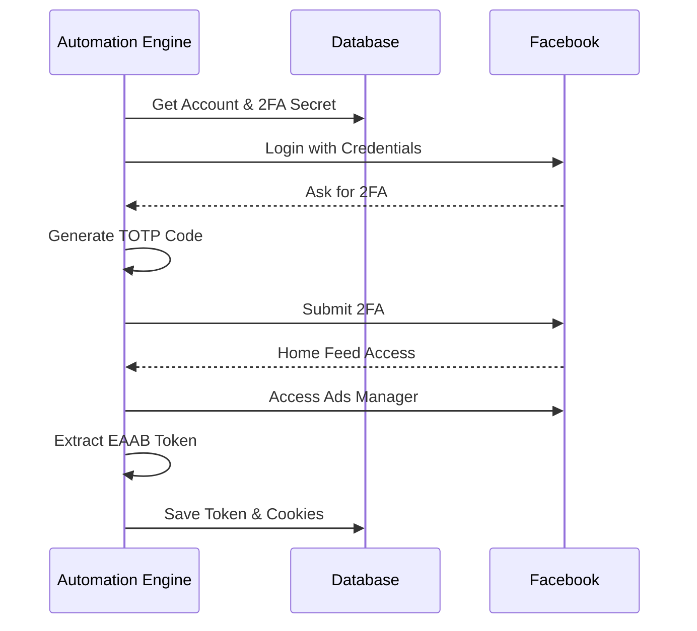
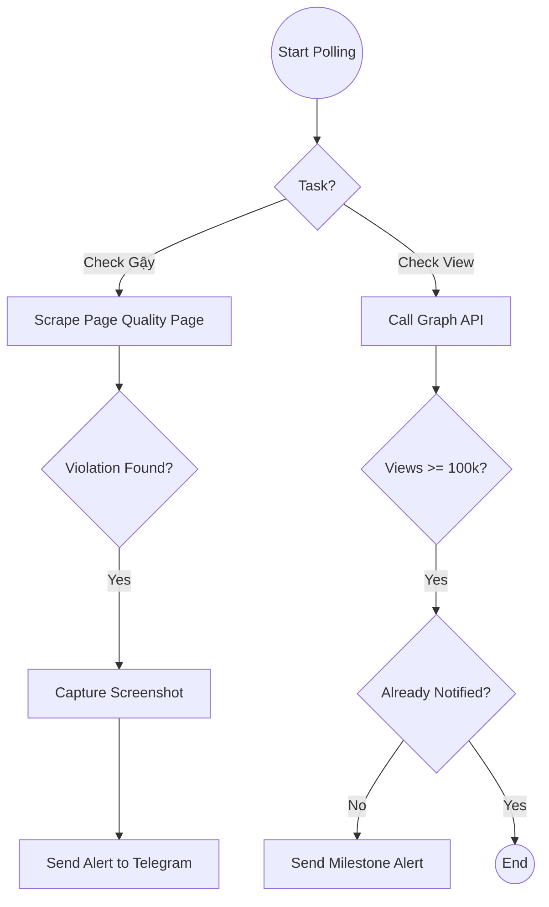
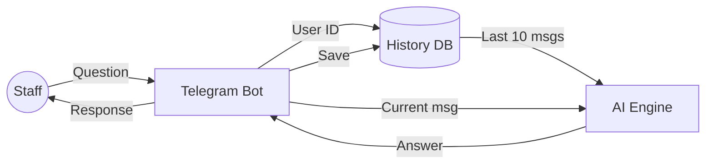
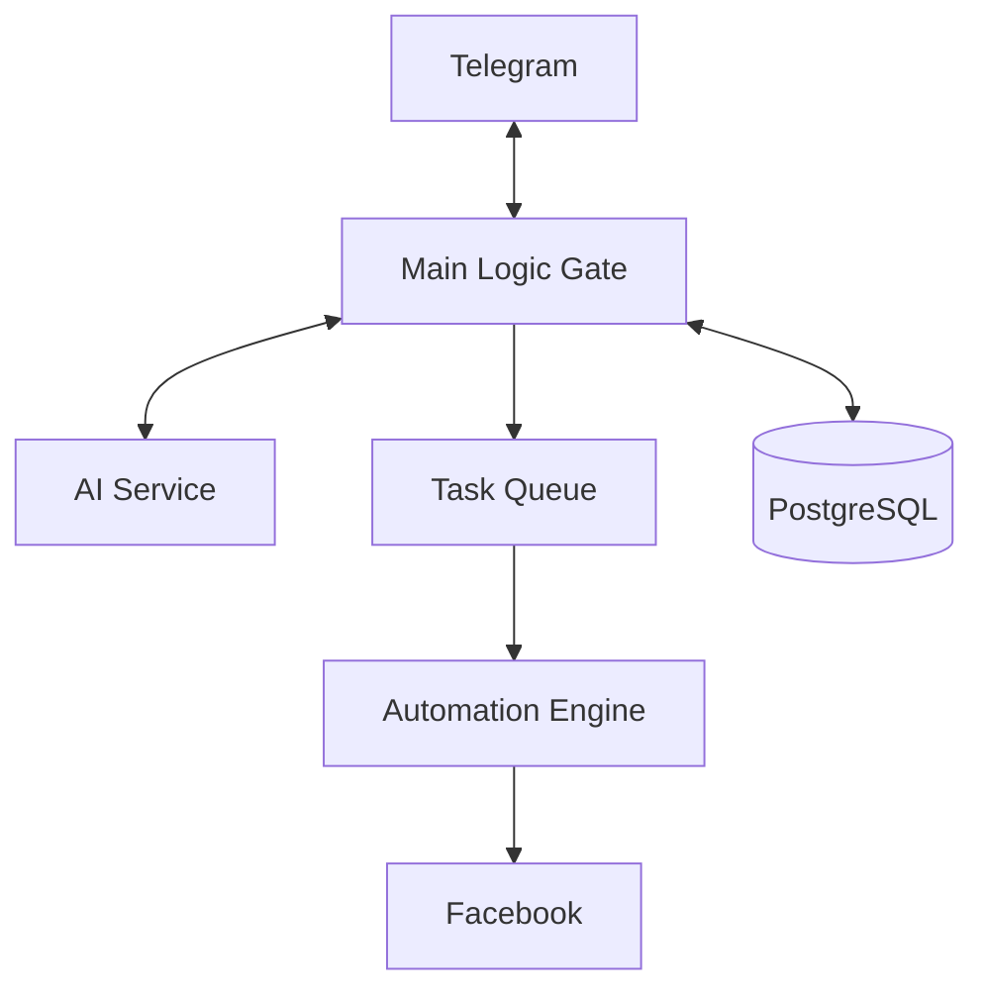
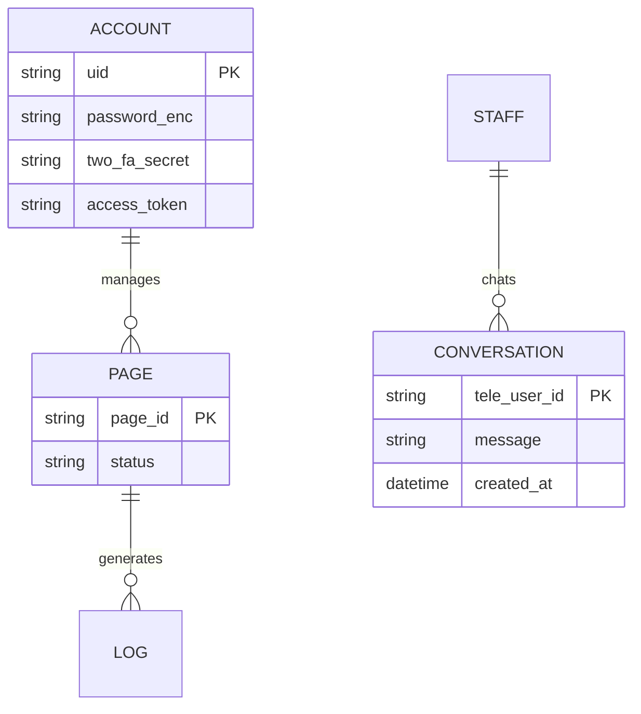

# MMO Agent Hub - Comprehensive System Design Specification

## 1. Introduction
The **MMO Agent Hub** is a specialized platform designed to automate and manage Facebook operations at scale. It leverages AI and advanced browser automation to monitor asset health, track performance milestones (100k views), and provide a context-aware AI assistant for staff via Telegram.

---

## 2. Component 1: Facebook Automation & Insight Bot
**Goal**: Automatically monitor Page Quality (strikes) and performance milestones (views/likes) without manual login.

### 2.1 Requirement Clarification (Làm rõ yêu cầu)
We need a system that can "act like a human" to access restricted areas of Facebook (like Page Quality) and "act like an API" to fetch data efficiently.

### 2.2 The "Need" (Cái chúng ta cần)
*   **Accounts**: FB UID, Password, and **2FA Secret Key**.
*   **Infrastructure**: Dedicated **Proxy IPs** (Residential preferred) to avoid cluster bans.
*   **Security Bypass**: A **Stealth Browser** environment (Puppeteer) to hide automation fingerprints.

### 2.3 Step-by-Step Implementation (Từng bước thực hiện)
1.  **Authentication**:
    *   Launch browser with Proxy and Stealth plugin.
    *   Inject credentials using human-like typing delays.
    *   Generate 6-digit TOTP from Secret Key and submit.
2.  **Token Extraction**:
    *   Navigate to Ads Manager.
    *   Scrape the high-privilege `EAAB` Access Token from source code.
3.  **Verification**: Confirm login status and save session cookies for future use.

#### Sequence Diagram: Login & Extraction

---

## 3. Component 2: Monitoring & Notification Service
**Goal**: Detect "Gậy" (violations) and viral milestones (100k views) and alert via Telegram.

### 3.1 Requirement Clarification
The system must proactively check for health issues that are not reported via standard APIs and track performance targets.

### 3.2 The "Need"
*   **Checkers**: Background workers that run periodically.
*   **Evidence**: Capability to capture screenshots of violations.
*   **Alerting**: Telegram Bot API integration.

### 3.3 Step-by-Step Implementation
1.  **Health Check (Scraping)**:
    *   Use saved cookies to visit `facebook.com/[page_id]/quality`.
    *   Search for keywords like "Violation" or "Restricted".
    *   If found, capture a screenshot and send to Telegram.
2.  **Performance Check (API)**:
    *   Use the `EAAB` token to call Graph API `/{post_id}/video_views`.
    *   Compare current value with thresholds (e.g., 100,000 views).
    *   If reached, send a congratulatory alert.

#### Activity Diagram: Monitoring Logic

---

## 4. Component 3: Telegram AI Intermediary
**Goal**: A bridge between staff and ChatGPT that "remembers" conversation history.

### 4.1 Requirement Clarification
Employees need to ask questions about the data or operations without re-training the AI every time. The AI must be "smart" and context-aware.

### 4.2 The "Need"
*   **Chat Interface**: Telegram Bot API.
*   **Memory**: A database to store `ConversationHistory` mapped to `tele_user_id`.
*   **AI Brain**: OpenAI GPT-4 with a specialized system prompt.

### 4.3 Step-by-Step Implementation
1.  **Message Ingestion**: Receive staff message via Telegram Webhook.
2.  **Context Retrieval**: Lục lại 5-10 câu chat gần nhất của nhân viên đó từ Database.
3.  **Prompt Construction**: Combine history + new question + system instructions.
4.  **AI Response**: Send back to Telegram and save the new exchange to history.

#### Data Flow: AI Context Logic

---

## 5. System Architecture & Data Design

### 5.1 High-Level Architecture

### 5.2 Database ERD (Entity Relationship)

---

## 6. Security & Scalability
*   **Encryption**: All FB credentials and 2FA keys are encrypted with AES-256.
*   **Proxy Isolation**: 1 Proxy per FB account to prevent detection.
*   **Self-Healing**: Automated re-login if Token expires.

## 7. Implementation Roadmap
1.  **Phase 1**: Login & Token (Done).
2.  **Phase 2**: Database persistence for accounts & logs.
3.  **Phase 3**: Telegram AI Integration with Context memory.
4.  **Phase 4**: Page Quality Scraper & Alerting.
