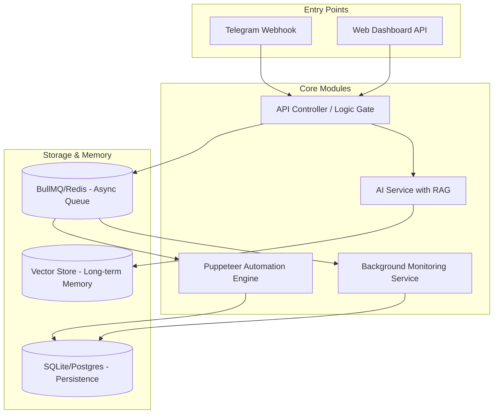

# MMO Agent Hub - System Design Specification

## 1. Introduction
The **MMO Agent Hub** is a specialized platform designed to automate and manage Facebook operations at scale. It leverages AI (LLMs) and advanced browser automation to provide a centralized dashboard for monitoring page health, post performance, and assisting staff via intelligent chat interfaces.

## 2. Core Objectives
- **Account Stability**: Use human-like automation to bypass bot detection.
- **Data-Driven Insights**: Automated tracking of Page Quality and Insights metrics.
- **AI-Powered Assistance**: Provide a "smart" intermediary between complex data and staff members using RAG (Retrieval-Augmented Generation).
- **Scalable Notification Hub**: Real-time alerts via Telegram for critical events.

---

## 3. System Architecture
The system follows a **Modular Monolith** architecture with **Event-Driven asynchronous tasks**.

### 3.1 Components Diagram

---

## 4. Detailed Component Design

### 4.1 Facebook Automation Engine (Puppeteer Service)
This module acts as the "Hands" of the system, simulating real user behavior to interact with Facebook's security layers.

#### 4.1.1 Facebook Login Workflow
1. **Environment Setup**: Launch a stealth-mode browser with a dedicated Proxy and custom User-Agent.
2. **Initial Navigation**: Access `facebook.com` and handle cookie/consent banners based on the region.
3. **Identity Injection**: Locate fields and use `humanType` (100ms-250ms delay) to mimic human typing speed.
4. **2FA Bypass**: Generate a 6-digit TOTP from `secret_2fa` and use a 3-retry loop for code submission.
5. **Post-Login Verification**: Handle "Trust Device" popups and verify the landing page (Home feed).
6. **Token Extraction**: Navigate to Ads Manager and scrape the high-privilege `EAA...` access token using optimized Regex.

#### 4.1.2 Error & Security Handling
1. **Checkpoint Detection**: Capture timestamped screenshots (`error_checkpoint_*.png`) if account restrictions appear.
2. **Session Persistence**: Save and reload Browser Cookies to minimize full login attempts and reduce account lock risks.

### 4.2 AI & RAG Engine (The "Brain")
This module provides reasoning and specialized knowledge retrieval for staff assistance.

#### 4.2.1 ChatGPT API Integration
1. **Authentication**: Secure connection via OpenAI API using environment-stored keys.
2. **Persona Configuration**: Inject a System Prompt defining the AI as an "MMO Operations Expert".
3. **Session Management**: Track conversations via `staff_id` and `session_id` to maintain context.

#### 4.2.2 RAG Strategy (Long-term Memory)
1. **Knowledge Indexing**: Periodically scan SOP files and chat history.
2. **Chunking & Embedding**: Split data into 500-token pieces and vectorize using `text-embedding-3-small`.
3. **Contextual Retrieval**: Perform vector search to find relevant snippets and inject them as context for the LLM.

### 4.3 Monitoring & Insight Service
This background service proactively tracks the health and performance of all managed assets.

#### 4.3.1 Automated Page Quality Scraper (Checking for Flags/Gậy)
Since Facebook doesn't provide a full "Page Quality" status via Graph API, the system uses Puppeteer for deep inspection:
1. **Navigation**: Uses stored session cookies to access `facebook.com/[page_id]/quality` or the "Support Inbox".
2. **Detection**:
   - Scans for specific keywords: "Your page has been restricted", "Violation", "Gậy bản quyền", "Vi phạm tiêu chuẩn cộng đồng".
   - Identifies the color indicator (Green = Healthy, Yellow = Warning, Red = Restricted).
3. **Evidence Capture**: If a violation is found, a full-page screenshot is taken and saved with the Page ID for staff review.

#### 4.3.2 Metric Tracking & Milestone Detection (100k Views/Likes)
Uses the extracted Access Token to fetch real-time performance data:
1. **Data Fetching**: Periodically calls Graph API nodes:
   - `/{page_id}/insights/page_impressions`
   - `/{page_id}/insights/page_post_engagements`
   - `/{post_id}/video_views`
2. **Threshold Logic**: The system compares current values against user-defined targets (e.g., Target = 100,000 views).
3. **State Management**: Prevents duplicate alerts by marking a milestone as "Achieved" in the `monitoring_logs` table once detected.

#### 4.3.3 Notification Dispatcher (Telegram Alert Hub)
1. **Aggregation**: Gathers results from both the Scraper and the Insight Fetcher.
2. **Alert Formatting**: Constructs a human-readable message in Vietnamese/English:
   - *Example 1 (Violation)*: `[ALERT] Page [Name] just got a restriction! Action: Check Support Inbox immediately.`
   - *Example 2 (Milestone)*: `[CONGRATS] Post [ID] has reached 100,000 views! Total Reach: 150k.`
3. **Dispatch**: Sends the message to the staff's Telegram Chat ID via the Bot API.

---

## 5. Database Design (ERD)

### 5.1 Main Entities
- **Accounts**: Stores FB credentials, 2FA secrets, and current token status.
- **Pages**: Links FB accounts to specific pages being monitored.
- **Users (Staff)**: Manages permissions for who can access which pages via Telegram.
- **ChatHistory**: Stores conversation logs for RAG indexing.

---

## 6. Security Considerations
- **Credential Encryption**: FB passwords and 2FA secrets are encrypted at rest using AES-256.
- **Proxy per Account**: Capability to assign unique proxy IPs per FB account to prevent cluster bans.
- **Credential Masking**: Logs must never reveal full passwords or secrets.

---

## 7. Implementation Roadmap
1. **Phase 1 (Completed)**: Core Automation & Token Extraction.
2. **Phase 2**: Database Schema & Persistence Layer.
3. **Phase 3**: Telegram Bot & AI Chat Integration.
4. **Phase 4**: RAG Implementation & Knowledge Indexing.
5. **Phase 5**: Monitoring Service & Alert Logic.
6. **Phase 6**: Web Dashboard for Analytics.
