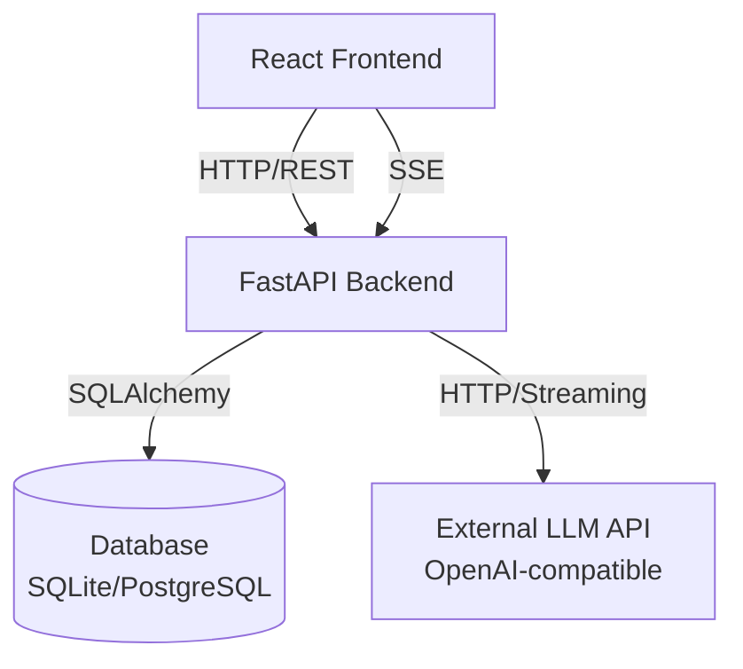
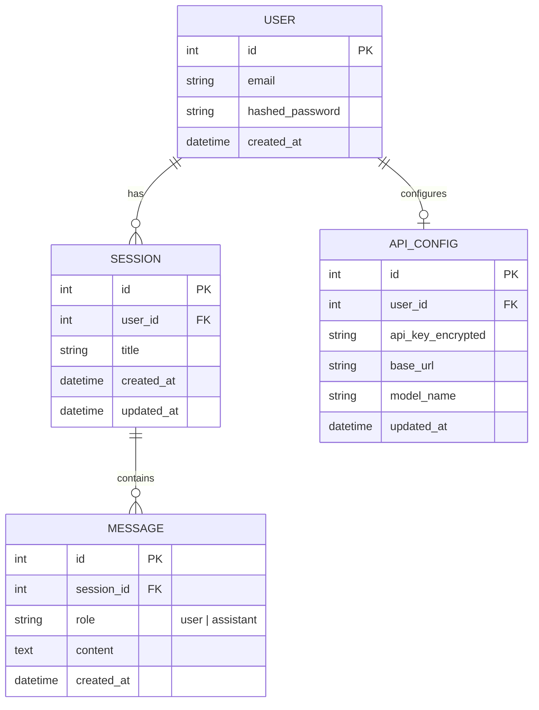
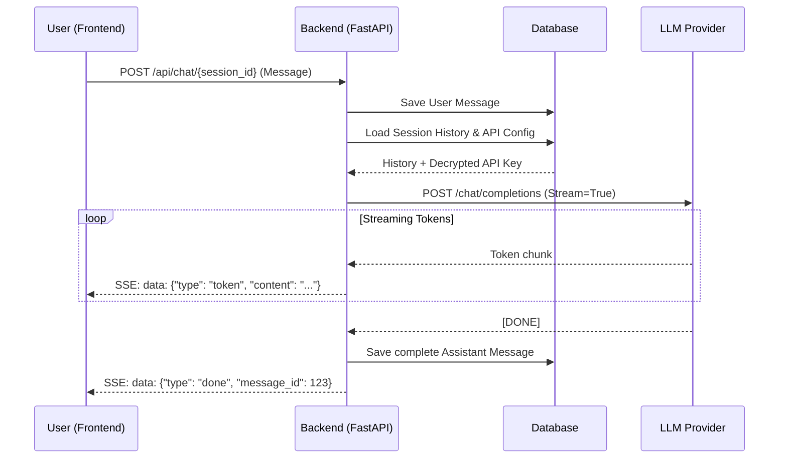
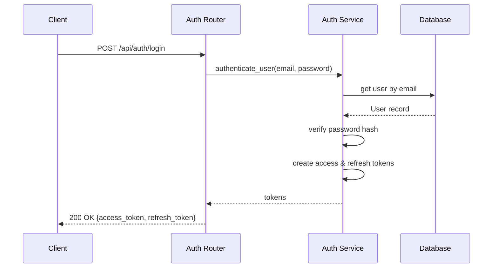

# LLM Chat Application - Technical Design

## 1. Overview
The LLM Chat Application is a full-stack platform that allows users to create sessions and interact with LLMs (like OpenAI GPT models). It features secure user authentication, session management, real-time message streaming via Server-Sent Events (SSE), and secure per-user API key management.

## 2. System Architecture

The system follows a classic client-server architecture with an external dependency on an LLM provider.

## 3. Technology Stack

- **Frontend**: React, Vite, Tailwind CSS, React Markdown.
- **Backend**: Python, FastAPI, Uvicorn (ASGI server).
- **Database**: SQLite (local development) / PostgreSQL (production), SQLAlchemy (Async ORM), Alembic (Migrations).
- **Security**: Passlib (Bcrypt) for password hashing, python-jose for JWT auth, cryptography (Fernet) for API key encryption.

## 4. Data Model

The database schema is designed to separate users, their chat sessions, the messages within those sessions, and their LLM API configurations.

## 5. Core Workflows

### 5.1 Chat Streaming Flow
Real-time streaming is critical for a responsive chat experience. We use Server-Sent Events (SSE) to stream tokens from the LLM back to the client as they are generated.

### 5.2 Authentication Flow
The application uses JWT (JSON Web Tokens) for stateless authentication.

## 6. Security & Data Protection

- **API Key Encryption**: User-provided LLM API keys are encrypted at rest using symmetric encryption (`cryptography.fernet`). The backend only decrypts them in-memory just before making the external HTTP request to the LLM provider.
- **Stateless Auth**: JWT is used for all protected endpoints. Expiration times are kept reasonably short to limit attack vectors.
- **Resource Isolation**: Every CRUD operation on sessions, messages, or settings strictly checks the `user_id` bound to the active JWT to prevent IDOR (Insecure Direct Object Reference) vulnerabilities.
